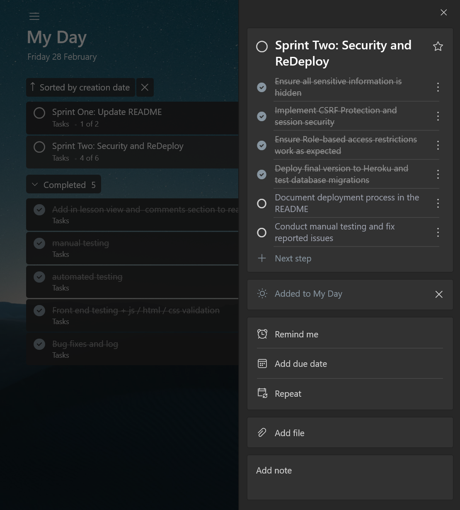
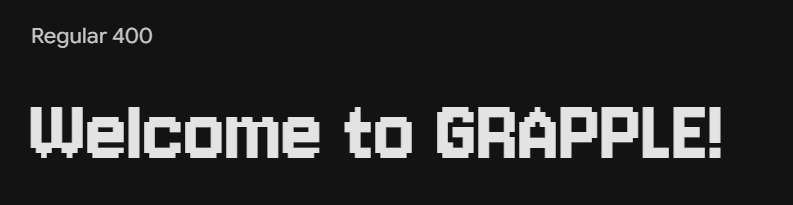
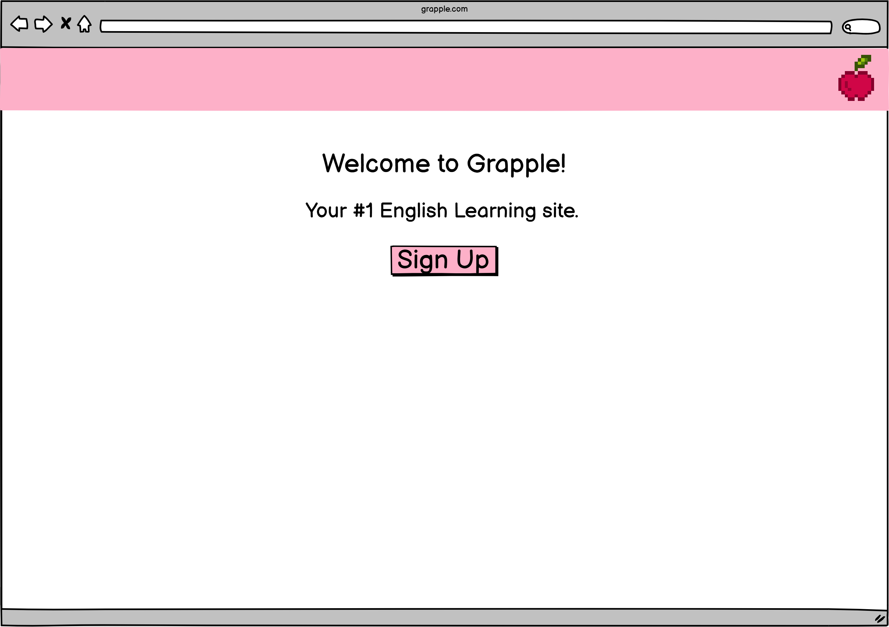
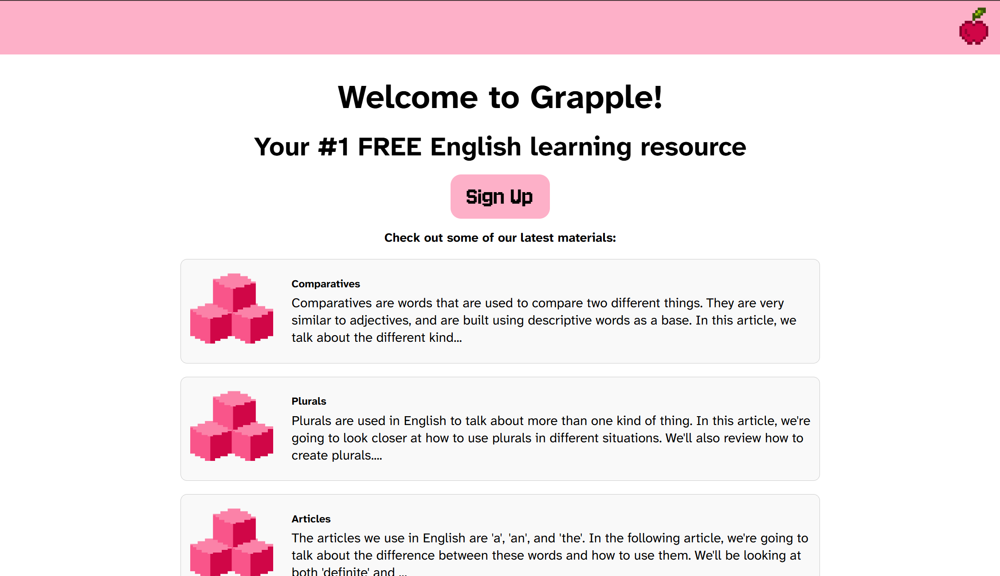
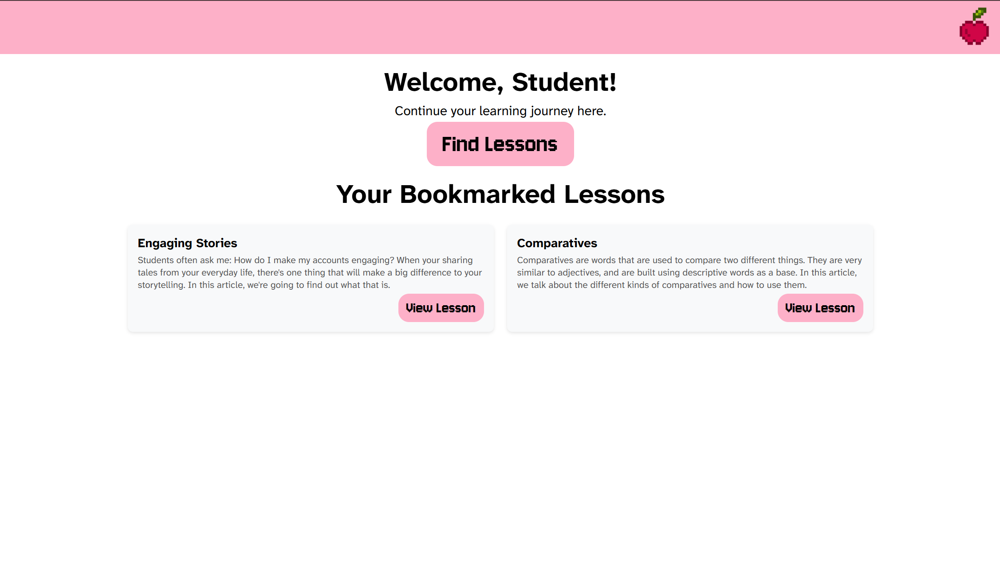
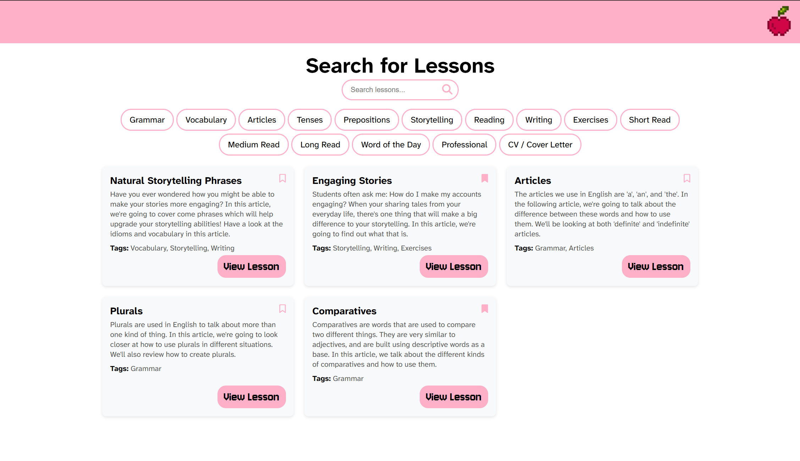
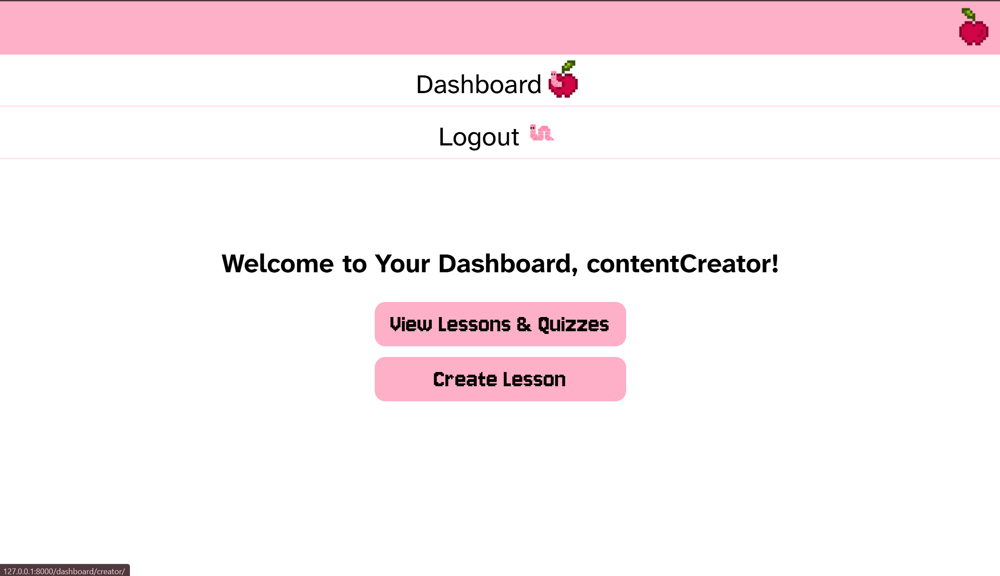
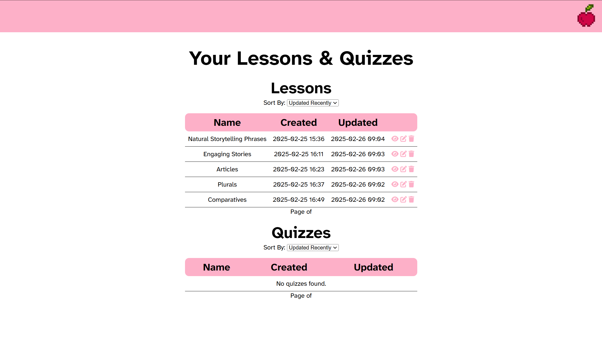
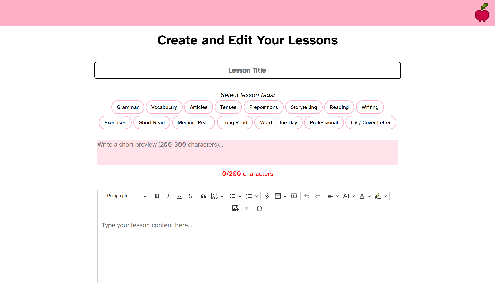

# Grapple

<br>


## Important Information
| Site              | Link |
|-------------------|------|
| Heroku Deployment | LINK | 
| Github Repository       | [LINK](https://github.com/jevpr/Grapple) |


## Grapple Login Details

| User type | Username | Password |
|-----------|----------|----------|
| Student   | student  | Testing123! |
| Content Creator | contentCreator | Testing123! |

<br>
<br>

# Contents

## Ideation and Design 
### 1. [Project Overview](#project-overview)
- [Description](#description)
- [Technologies Used](#technologies-used)

### 2. [Users](#users)
- [User Roles](#user-roles)
- [User Stories](#user-stories)
### 3. [Features](#features)
### 4. [Frontend](#frontend)
- [Colour Scheme](#colour-scheme)
- [Fonts](#fonts)
- [Pixel Assets](#pixel-assets)
- [Wireframes and UI](#wireframes)

### 5. [Backend](#backend)

### 6. [Authentication & Security](#authentication--security)
- [User Authentication](#user-authentication)
- [Role-Based Access Control (RBAC)](#role-based-access-control-rbac)
- [Password Security](#password-security)
- [Session Management & CSRF Protection](#session-management--csrf-protection)
- [Deployment & Security Considerations](#deployment--security-considerations)


<br>
<br>

# Project Overview

## Description
Grapple is a VLE (virtual learning environment) designed for people studying English. 

It's aimed at users who want to benefit from an English learning site with a fun and playful interface. 

These users will be more advanced in the language already, and want access to articles that can help them develop  their skills further. 

The project takes inspiration from Duolingo in it's use of cute avatars and bright colours to inspire students and keep the learning environment energetic. 

Although Grapple is still in early stages of development, later iterations will include features like games, quizzes, advanced notes features, and progress tracking. 

Grapple keeps English learner's notes and materials in one place, making it easy for them to access and keep track of their learning. A consistent and accessible style across the site removes barriers to learning, and ensures all information can be easily absorbed. 

## Technologies Used
| **Category**           | **Technologies Used** |
|-----------------------|----------------------|
| **Frontend**         | HTML, CSS, JavaScript |
| **Backend**          | Django (Python) |
| **Database**         | SQLite3 |
| **Version Control and AGILE development**  | Git & GitHub, Microsoft To_do |
| **Deployment**       | Heroku
| **Libraries & Tools** | Django Authentication, CKEditor5 for rich text editing, Django Signals for user group management |


### Agile Development
Grapple was developed using an Agile approach, with tasks organized and tracked using Microsoft To Do. While it is not a traditional Agile tool like Trello or Jira, it was effectively used to:

1. Organize backlog items (features, bug fixes, and improvements).
2. Prioritize tasks based on project milestones.
3. Track progress using checklists and completion status.
4. Break development into iterations (e.g., Authentication, Lesson CRUD, UI Enhancements).

Below is an example of how tasks were structured in Microsoft To Do:


I reviewed the to-do list on a daily basis, to make sure I was on track and had kept up to date on everything I needed to review.

Using this approach, each user story was assigned a corresponding checklist item.

| User Story | Agile Task in Microsoft To-Do | Status |
|------------|------------------------------|---------|
| As a student, I want to register an account... | "User Registration" Task | Completed |
| As a student, I want to log in securely... | "User Authentication" Task | Completed |
| As a content creator, I want to create a lesson... | "Lesson Creation Feature" Task | In Progress |


<br>
<br>

# Users

## User Roles
| User type | Permissions |
|-----------:|----------|
| **Unauthenticated**| Can browse some of the site but has limited access to functionality and materials. | Testing123! |
| **Students** | Can search, read, bookmark, and make notes / comments on lessons. Dashboard allows them to access bookmarked lessons quickly. | Testing123! |
| **Content Creators** | Can create, read, update, and delete (CRUD) lessons from their dashboard. lesson creator allows them to add title, tags, preview, and content.|

## User Stories 
### Students

<em>As a student, I want to be able to: </em>

- register an account, so that I can access lessons, bookmark important materials, and save notes. 
- securely log in and log out, so that my personal data is protected. 
- browse available lessons, so that I can learn new topics at my own pace. 
- search for lessons using a specific key word or tag name, so that I can quickly find relevant material.
- open a lesson and view its content, so that I can study the material in detail. 
 - add personal notes to a lesson, so that I can refer to key points later. 
 - comment on lessons, so that I can ask questions or discuss the topic with others.

<br>

 Grapple 2.0 (March 2025):
 - see my lesson progress, so that I can keep track of what I have completed. 
- take quizzes after completing lessons, so that I can assess my understanding.
- see my quiz scores and correct answers, so that I can improve my knowledge. 


### Content Creators

<em>As a content creator, I want to be able to: </em>

- navigate an intuitive dashboard, so that I can quickly manage my lessons. 
- log in securely so that my content cannot be edited by unauthorized users. 
- create new lessons, so that students have educational material to learn from. 
- format lessons content with headings, tables and lists, so that the material is engaging and readable (using a rich text editor).
- edit lessons, so that I can update content as needed. 
- delete lessons, so that I can remove outdated or incorrect content. 
- organize lessons by tags using relevant key words, so that students can find related content easily. 

Grapple 2.0 (March 2025): 
- view and respond to comments on my lessons, so that I can interact with students and keep up to date on the success of articles.
- view student progress and quiz scores for my lessons, so that i can assess how well students are learning.
- create quizzes for lessons, so that students can test their knowledge. 

<br>
<br>

## Features

Grapple features include: 
- User sign up, authentication, and authorization
- A fully-responsive, accessible, mobile-first UI 
- Role-based access control and functionalities
- Search and filtering functionalities for students looking through lesson materials
- Interactive elements (comments and notes for students, dynamic content updates for content creators)
- CRUD functionality for lesson materials (for content creators)
- Cloud deployment for live accessibility 

<br>
<br>


## Frontend


## Colour Scheme


The initial colour theme for this project was simple and playful. Although a more feminine colour like pink can limit a user base, I wanted users to associate the site with lightheartedness and playfulness. 

Pink therefore seemed an appropriate colour, making the learning interface cute and appealing. The aim with this colour scheme was to create an association between learning and enjoyment. 

Later versions of the UI will offer a theme toggle, allowing users to toggle between colour schemes. 

<br>
<br>


## Font

This project uses two major font types: 
1. Jersey 10
2. Atkinson Hyperlegible Classic 

Jersey 10 is a pixel font, used as part of the sites branding plan. For more information, see the [Pixel Assets section](#pixel-assets). This font was used for larger titles and form inputs. 



<em>An example of the Jersey 10 font</em>

<br>

Atkinson Hyperlegible Classic is a sans serif font that has been used for all learning content on the platform. This font was chosen for its excellent readability and professional look. 


<em>An example of Atkinson Hyperlegible</em></em>

<br>
<br>


## Pixel Assets

The pixel image reflects Grapples approach to learning: that it should be fun, simple, and modular. In other words, in the way pixel images are made up of lots of smaller parts, the most effective approach to learning breaks down the process into small, bitesize chunks. 

Pixels were also used in the inital design to evoke a sense of nostalgia and playfulness in the brand. In later versions of Grapple, the pixel theme can be further integrated into progress tracking, games, quizzes, animations and other parts of Grapple's brand.


<br>
<br>

## Wireframes and Layout

- [Nav Bar](#nav-bar)
- [Landing Page](#landing-page)
- [Sign Up Page](#sign-up-page)
- [Student Dashboard](#student-dashboard)
- [Lesson Search](#lesson-search)
- [Content Creator Dashboard](#content-creator-dashboard)
- [Lesson Management](#lesson-management)
- [Lesson Creation](#lesson-creation)


The initial wireframes design outlined the layout and navigation for the landing page and sign up page. Other html templates worked from this design, using a nav bar: main content layout. 
 
 ### Nav Bar
The logo is place in the top right corner to optimize interaction for right handed mobile users. This is the main point of navigation for users across the site, offering links to: Home, Sign Up, About, Login. 

Python elif script changes the content of this dropdown to respond to different user types after log in: a student dashboard or content creator dashboard, and log out.

#### Landing Page

<em>Landing Pgae Wireframe</em>

.png)
<em>Landing Page Wireframe with Dropdown</em>



<em>Above is a screetshot of Grapple's current landing page. The current version features previews of lessons with the tag 'grammar', to give students a taste of the materials available on the platform and to encourage potential users to sign up to the site. The CTA button to 'sign up' is clear and prominent. </em>

#### Sign Up Page

<em>Above is the original design for the sign up form. As well as entering a username, email, and password, users have the option to choose from 1 of 5 avatars. </em>


<em>Sign Up Wireframe with Dropdown</em>


### Student Dashboard

<em>Above, is a screenshot of the current student dashboard. It features a button to take you to the lesson search page, and shows all the lessons a student has bookmarked. </em>

### Lesson Search 


<em>Above is a screenshot of the student lesson search page, where students can serach for lessons using a keyword, or select pre-ordained tags to filter through search results. They have the option to bookmark these lessons in the lesson search page, or from the main lesson view.</em>

### Content Creator Dashboard

<em>Above is a screenshot of the content creator dashboard, where lesson creators can choose to manage their lesson content, or create a lesson.</em>

### Lesson Management

<em>Above is a screenshot of the lesson management page, where content creators can view, edit, and delete the lessons they have created. They have the option to arrange lessons in order of creation, recently edited, and name, to make it easier to find the lesson they're looking for.</em>

### Lesson Creation

<em>Above is a screenshot of the lesson creation page. Here content creators can give their lesson a title, assign relevant tags, write a short preview, and enter the main content of the lesson. </em>

<br>
<br>
<br>


## Backend

## Database Design

You can see the ERD for Grapple's database here: 
[LINK](https://lucid.app/lucidchart/eb04cdc2-e52d-4d54-81c1-61a33f8216c2/edit?viewport_loc=-2391%2C226%2C4905%2C2447%2C0_0&invitationId=inv_a2c1b154-7901-46e9-869c-9512ee2041a4).


- **User Model:** Differentiates between **students** and **content creators** for access control.  
- **Lesson Model:** Stores structured content for each lesson, allowing CRUD operations for content creators.  
- **Bookmark, Comment & Note Models:** Enable students to interact with lessons.  
- **Quiz & Progress Models (Future Feature):** These are planned for Grapple 2.0 to support interactive learning and student progress tracking.  


<br>
<br>

## User Authentication
Grapple uses Django’s built-in authentication system to manage user login and registration securely.

### **Registration**
- Users can register an account using **CustomUserCreationForm**.
- During registration, **Django automatically hashes passwords** for security.
- Users are **automatically assigned to the "Students" group** using Django signals.

### **Login**
- Users log in using Django’s authentication system.
- Django handles **session management** to maintain user state.
- Only authenticated users can access protected views.


## Role-Based Access Control (RBAC)

- **Students**: Can browse and bookmark lessons.
- **Content Creators**: Can create and manage lesson content.
- Group assignment is handled via **Django Admin** or automatically via signals.

User permissions are enforced using Django’s built-in **groups and decorators**.

### **Access Restrictions**
- **Students** can only access **lesson-related features**.
- **Content Creators** can access **lesson creation and management tools**.

### **Implementation**
- `@login_required` ensures that only authenticated users can access protected pages.
- `@user_passes_test(is_student)` and `@user_passes_test(is_content_creator)` restrict access based on role.

### **Example: Restricting Content Creator Dashboard**
```python
@login_required
@user_passes_test(is_content_creator)
def creator_dashboard(request):
    return render(request, 'dashboard/creator_dashboard.html')
```


## Password Security
- Grapple **does not store raw passwords**. Django automatically encrypts them using **PBKDF2 hashing**.
- Passwords are stored securely in Django’s database and are never exposed in plaintext.

### **Enforcing Strong Passwords**
Django uses the following password validators:
- **Minimum length validator** (8+ characters).
- **Common password validator** (prevents weak passwords).
- **Numeric password validator** (avoids fully numeric passwords).


## Session Management & CSRF Protection
### **User Sessions**
- Django uses **session-based authentication** (cookies).
- After login, Django creates a secure session ID stored in the user’s browser.

### **CSRF Protection**
- All forms use `` to prevent **Cross-Site Request Forgery (CSRF) attacks**.
- Any request modifying data (e.g., posting comments) is protected.

### **Secure Logout**
Users can securely log out using Django’s `logout` function:
```python
def logout_view(request):
    logout(request)
    return redirect('landing')
```


## Deployment & Security Considerations
### **Environment Variables**
- All sensitive data (e.g., `SECRET_KEY`, database credentials) are stored in **environment variables**.
- `.env` files are used locally, and variables are loaded securely in production.

### **Production Settings**
- **`DEBUG = False`** in production to prevent security leaks.
- **`ALLOWED_HOSTS`** is set to restrict accepted requests.
- **`SECRET_KEY` is hidden** using environment variables.

### **Preventing Insecure Deployment**
- **Passwords and keys are NEVER stored in GitHub**.
- **Django security middleware is enabled** to prevent common attacks.


## Testing

### Manual Testing

| **Feature** | **Test Case** | **Steps** | **Expected Result** | **Status** |
|------------|-------------|-----------|-----------------|----------|
| **User Authentication** | Registration | Enter valid details → Click "Sign Up" | Account is created, user redirected |  Passed |
|  | Login (valid) | Enter correct username & password → Click "Login" | User is logged in and redirected |  Passed |
|  | Login (invalid) | Enter wrong credentials → Click "Login" | "Invalid credentials" error message appears |  Passed |
|  | Logout | Click "Logout" button | User is logged out, redirected to home |  Passed |
| **Role-Based Access (RBAC)** | Student accessing `/dashboard/creator/` | Log in as student → Visit `/dashboard/creator/` | Redirected to `/dashboard/student/` |  Passed |
|  | Creator accessing `/dashboard/student/` | Log in as creator → Visit `/dashboard/student/` | Redirected to `/dashboard/creator/` |  Passed |
|  | Unauthenticated access | Visit `/dashboard/student/` without logging in | Redirected to `/login/` |  Passed |
| **Lesson Management** | Create Lesson | Creator fills form & submits | Lesson appears in lesson manager |  Passed |
|  | Edit Lesson | Creator edits a lesson & saves | Changes are saved |  Passed |
|  | Delete Lesson | Creator deletes a lesson | Lesson is removed from database |  Passed |
| **Student Features** | Bookmark Lesson | Student bookmarks/unbookmarks a lesson in either lesson_search or lesson_view | Lesson appears/disappears in "Bookmarked" section |  Passed |
|  | Add Comment | Student posts a comment | Comment appears under the lesson and is visible to other users |  Passed |
|  | Add Note | Student posts a personal note | Note appears under the lesson and isn't visible to other users |  Passed |
| **Search & Filtering** | Search Lessons | Enter keyword in search bar | Only matching lessons appear |  Passed |
|  | Filter by Tags | Select a tag filter | Only lessons with selected tag appear |  Passed |


### Automated Testing
As automated testing was optional according to the Portfolio 3 Assessment Guide, this will appear in the next iteration of Grapple. 


### Validation
The Grapple code was validated using the following methods: 
1. HTML: W3C Validator passed with no issues
2. CSS: Passed through Jigsaw with no major issues
3. JavaScript passes through jslint.com with no major issues
4. Python code is consistent in style and conforms to the PEP8 style guide


<em>Screenshot of HTML validation successful</em>


<em>Screenshot of CSS validation successful</em>

## Deployment

1. Set up a django file locally 
First, a venv and django project were established locally: 
```bash
python -m venv venv 
```

Django and necessary packages were installed: 
```bash
pip install django gunicorn psycopg2-binary dj-database-url

```

A django project was created. 
```bash
django-admin startproject EnglishLearning
```

Initial models, migrations, and superusers were created and run:
```bash
python manage.py migrate
python manage.py createsuperuser
python manage.py collectstatic --noinput
```

The server was tested locally
```bash
python manage.py runserver
```


2. Push code to GitHub

The project was linked to a GitHub repository using VS Code's built-in features. 

3. Link Heroku account with GitHub and deployed manually using branch deployment

After signing in to Heroku, and linking to my Github, I deployed to Heroku by publishing from the main branch of my GitHub repository (Grapple).

After deploying to Heroku, the live site was tested against the local development version to ensure:  
- All core features (authentication, lesson search, CRUD operations) work as expected.  
- The database is correctly configured, and all models function as intended.  
- Role-based access control restricts user actions appropriately.  

No inconsistencies were found between the local and deployed versions.  


## Future Features & Roadmap
Grapple will continue to improve with the following planned updates:

### **Planned Features**
**Comment Editing & Deletion**: Students will be able to edit and delete their own comments.  
**User Progress Tracking**: Track lessons completed and quiz scores.  
**Interactive Quizzes**: Add multiple-choice quizzes for students to test their knowledge.  
**Improved Search Functionality**: Advanced filtering options for lessons.  


## Credits
 
This project, Grapple, is my own original work. Any code, assets, or resources that were not created by me have been properly referenced and credited where applicable.

If any similarities to external sources exist, they are purely coincidental or the result of using widely accepted development practices. All code, design, and documentation presented in this submission reflect my understanding and effort.

Font: [Google Fonts](https://fonts.google.com/)

Pixel Art: [piskelapp.com](piskelapp.com)

FontAwesome - [fontawesome.com](fontawesome.com)

Django CKEditor 5 - [https://ckeditor.com/](https://ckeditor.com/)

### Other Third Part Libraries and Dependencies
- Django Authentication & User Management - Used for user registration and login
- Django Signals - Auto-assigning users to groups
- Django ORM - For database interactions
